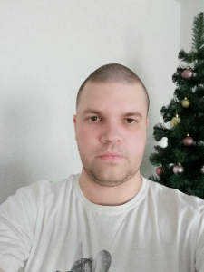

## [rsschool-cv](https://aeveron1990.github.io/rsschool-cv/cv "Url on project")


# ***Merzlyakov Vasiliy***
## **Contacts:**
**Phone number:** +7(923)418-18-26  
**Email:** averon1990@mail.ru  
**Discord:** aeveron(@aeveron1990)  
**GitHub:** [Merzlyakov Vasiliy](https://github.com/aeveron1990 "Url on GitHub")

## About Me:
I am 31 years old. My goal is to start a career as a junior front-end developer. I am currently working in the oil industry and studying JS. My strengths are ***discipline*** and a ***responsible approach*** to work.
## My skills:
* HTML (*beginner level*) 
* CSS (*beginner level*)
* JS (*beginner level*)

## Code example:
```
function paperwork(n, m) {
    if (n > 0 && m > 0) {
        return (n * m);
}   else {
        return (0);
}
}
```
## Education:
* HTML for beginners ([ru.code-basics.com](https://ru.code-basics.com/ "Url on code-basics"))
* CSS for beginners ([ru.code-basics.com](https://ru.code-basics.com/ "Url on code-basics"))
* JS video course ([Udemy](https://www.udemy.com/course/javascript_full/ "Url on Udemy"))

## Programming experiense:
*no experience other than taking courses*

## English
**A** - basic user